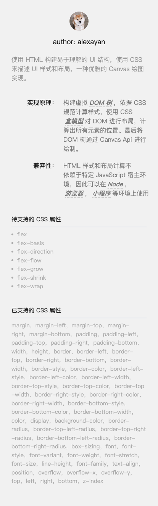

## 简介

基于 HTML 和 CSS 实现 Canvas 绘图。

## 原理

构建虚拟DOM 树，依据 CSS 规范计算样式，使用 CSS 盒模型对 DOM 进行布局，计算出所有元素的位置。最后将 DOM 树通过 Canvas Api 进行绘制。

## 小程序内使用

`npm install --save html-canvas`

```javascript
import {Node, Canvas} from 'html-canvas';
const ctx = wx.createCanvasContext('canvas');
const canvas = new Canvas(ctx);
const tree = Node.fromHtml(htmlstr);
tree.layout(ctx).then(() => {
  this.setData({
    canvasStyle: `width: ${tree.boxWidth().value()}px; height: ${tree.boxHeight().value()}px;`
  })
  canvas.draw(tree, false, () => {
    wx.canvasToTempFilePath({
      x: 0,
      y: 0,
      width: tree.boxWidth().value(),
      height: tree.boxHeight().value(),
      canvasId: 'canvas',
      success(res) {
        console.log(res);
      }
    })
  });
});
```

## 待支持的 CSS 属性

- [] flex
- [] flex-basis
- [] flex-direction
- [] flex-flow
- [] flex-grow
- [] flex-shrink
- [] flex-wrap

## 已支持的 CSS 属性

margin，margin-left，margin-top，margin-right，margin-bottom，padding，padding-left，padding-top，padding-right，padding-bottom，width，height，border，border-left，border-top，border-right，border-bottom，border-width，border-style，border-color，border-left-style，border-left-color，border-left-width，border-top-style，border-top-color，border-top-width，border-right-style，border-right-color，border-right-width，border-bottom-style，border-bottom-color，border-bottom-width，color，display，background-color，border-radius，border-top-left-radius，border-top-right-radius，border-bottom-left-radius，border-bottom-right-radius，box-sizing，font，font-style，font-variant，font-weight，font-stretch，font-size，line-height，font-family，text-align，position，overflow，overflow-x，overflow-y，top，left，right，bottom，z-index

## demo

[canvas-draw.html](./canvas-draw.html)

